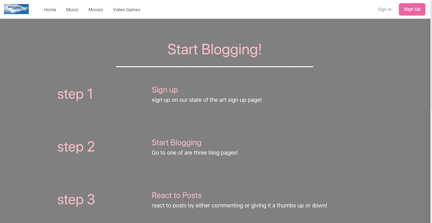

# Media-Metrics

## Description

## This application was designed to connect people with common interests across a variety of subjects.

## Table of Contents

- [Installation](#installation)
- [Usage](#usage)
- [Collaborators](#collaborators)
- [License](#license)

## Installation

- Download files from github
- run terminal with file path
- run 'npm i' in terminal
- run 'npm run seeds' in terminal
- run 'npm run start' in terminal
- view website at Localhost:3001 in web browser

## Usage

The application is a blog site that initially focuses on three areas of interests.

- Movies
- Video Games
- Music

Once a user creates an account they can access a dedicated page for each of the interests listed above. Each page will keep a persistent record of a User's posts and replies.

## Collaborators

- Jeramy Sena [Gtihub](https://github.com/JeramySena)
- Djamel Ramdani [Gtihub](https://github.com/scorpiondz1999)
- Justin Eicher [Github](https://github.com/Justin-Eicher)
- Bryan Keller [Gtihub](https://github.com/kcbryan10)

## Technologies

- React [source](https://reactjs.org/)
- Chakra [source](https://chakra-ui.com/)
- Java Web tokens [source](https://jwt.io/)
- GraphQl [source](https://graphql.org/)
- MongoDb [source](https://www.mongodb.com/)
- express [source](https://expressjs.com/)
- sass [source](https://sass-lang.com/)
- node [source](https://nodejs.org/en/)
- nodemon [source](https://www.npmjs.com/package/nodemon)

## License

[MIT License](https://mit-license.org)
